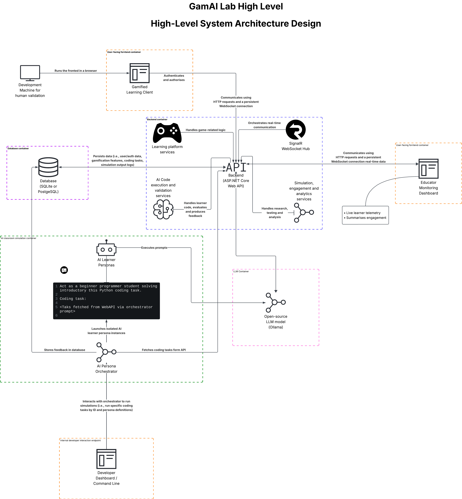
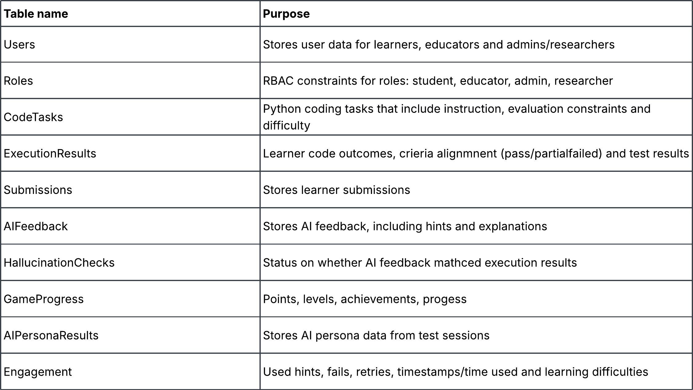

# GamAI Lab
AI-Assistive Gamified Code Training  using Simulated AI Persona Evaluation

## High-level system Architecuture Design

## Backend Service Components

## Database Tables

## Initial project setup

Docker code execution image
1. 'cd' into code runner 'cd GamAILab.CodeRunner'
2. 'docker build -t gamai-lab-code-runner:0.1 .'
3. Verify that it exists using 'docker image ls gamai-lab-code-runner'